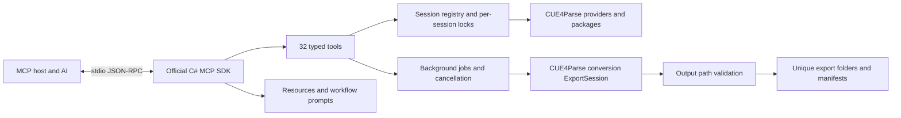

# FModel MCP design and feature coverage

## Purpose and architecture

FModel's purpose is to explore Unreal Engine archives, understand cooked assets and their relationships,
and preview/export the supported content. The useful AI interface therefore exposes archive and asset
operations directly rather than describing mouse clicks in the desktop UI.

The implementation is a separate .NET executable sharing the parser/conversion projects used by FModel.
This avoids the WPF application, dispatcher, tabs, audio player, and OpenGL viewport dependencies embedded
in `CUE4ParseViewModel`. The same game-profile provider selection is reproduced for Ash Echoes, Honor of
Kings World, Lord of Mysteries, and the Theia-based games; other games use DefaultFileProvider. Extra
per-game directories that FModel implicitly loads from AppData are not accessed automatically.

`FModelTools` is the protocol boundary: bounded JSON/text or image results, error classification, and tool
annotations. `FModelService` owns session/provider lifetimes; its inspection, extra-format, and export
partials isolate the different workflows. `PathPolicy` handles local input and export constraints.
The official SDK implements JSON-RPC, protocol negotiation, tool schemas, cancellation notifications,
resources and prompts. Logs are isolated from protocol stdout.

## Coverage mapped to FModel

| FModel workflow / implementation | MCP implementation | Boundary |
| --- | --- | --- |
| Directory selection, `CUE4ParseViewModel` provider construction | Explicit `open_game`, version/profile options, multiple session IDs | Local directories only; no implicit AppData searches |
| `Initialize`, `LoadVfs`, AES Manager | Mount on open, archive metadata, missing GUIDs, submit keys | No remote AES lookup |
| `InitMappings` | Local USMAP/JMAP/GZip-JMAP | No mapping downloads |
| Asset folder/search views | Browse, filter search, extension statistics, metadata | Paginated; registry class search is separate |
| Package JSON tabs and metadata | Summary, exports/imports/names, selected properties, JSON pointer navigation | Cooked parser output, not recovered source |
| Reference search | Package imports and IoStore referencers | Explicitly incomplete soft-reference coverage |
| AssetRegistry.bin view | Registry load and class/tag search | One active registry per session |
| Localization and binary config readers | Culture loading, string search, locres/locmeta/binaryConfig inspection | Ordinary text uses bounded file reading |
| Texture tab | Inline PNG preview and converted export | No UI channel/layer manipulation |
| Blueprint decompiler | Paginated approximate pseudocode | No original C++ recovery; cooked data may be incomplete |
| Raw export | Package and payload extraction | Unique output directories |
| Export session and option view model | Background conversion and full export option model | Uses available upstream type/format combinations |
| Model/material/skeleton/animation/world pipeline | Native CUE4Parse exporters, dependency queue, USD worlds | Requires dependencies/codecs; no rendered 3D viewport |
| Sound decoding | SoundWave/SoundNodeWave/AkMediaAssetData output | External-bank tooling and interactive playback omitted |
| Backup/version comparison | Two-session metadata comparison, optional per-file hash verification | No unqualified claims of byte equality |
| Desktop-specific tools, live providers, creators | Advertised as unavailable | No fake success or stub tools |

All 32 tools are implemented; the unavailable features above are not placeholder tool registrations.
The command-by-command parameter reference and AI workflow examples are in [mcp.md](mcp.md).

## State, scale, and failure behavior

Each server process serves one stdio client and has an explicit bounded registry of sessions/jobs.
The model passes handles instead of relying on a hidden selected game. Provider operations are serialized
within each session to prevent concurrent mutation/disposal. Blueprint decompilation additionally holds a
process-wide lock because CUE4Parse uses static decompiler state. Jobs keep progress accessible during
long conversions and collect failures per requested asset so later assets can continue.

Search responses are paginated and bounded in character count; property navigation avoids requiring
entire package JSON in model context. Parsing still has intrinsic memory/native-code costs and is not
a resource sandbox. Jobs write a manifest before entering terminal state, and cancellation retains
partial outputs. A fresh GUID directory prevents new jobs from overwriting earlier exports.

The server distinguishes filesystem paths, virtual file paths, Unreal object paths, and JSON pointers.
It never guesses game versions, AES keys, mappings, or original asset source. It labels metadata diffs and
partial reference graphs with their evidence limits.

## Dependency integration

The parser is bootstrapped into the ignored `CUE4Parse/` directory. Bootstrap uses upstream revision
`2bcceaf7bf129e4a52bc36d0a174dd3efb5fbfe0` with ZIP SHA-256
`B93A68CE9E88027DD5C2E9DDF72C9A56112B4E92DF56885DC7C9570CC2A1FA0F`.
It preserves existing source and fails if the expected integration points are absent.

Two integration changes are deliberately small and reproduced by `scripts/Initialize-Mcp.ps1`:

1. `ExportSession.OutputPathValidator`: an optional callback applied before directory creation to every
   conversion output, including automatically queued dependencies. FModel's desktop behavior is unchanged
   when the callback is absent. The MCP server checks path containment, invalid/device names and links.
2. Direct `Microsoft.Bcl.Memory` 10.0.10 dependency: replaces the vulnerable transitive 9.0.0 version
   discovered during restore. See the [.NET advisory](https://github.com/advisories/GHSA-73j8-2gch-69rq).

MCP uses the official [C# SDK](https://github.com/modelcontextprotocol/csharp-sdk) NuGet package 2.2.0 and
its [stdio hosting pattern](https://github.com/modelcontextprotocol/csharp-sdk/blob/main/docs/concepts/getting-started.md).
Using the SDK keeps the protocol implementation separate from FModel's domain operations.

## Future extensions

Desktop viewport control needs an explicit opt-in IPC bridge inside FModel with dispatcher-safe methods.
Live/streamed providers need a separate network/credential design. Complete reverse-reference indexing
needs a persistent per-build index and broader soft-reference analysis. External audio banks, native Lua
decompilation and game-specific renderers need additional adapters and representative fixtures.
These are distinct extensions, not claims of implemented parity with every FModel UI feature.
